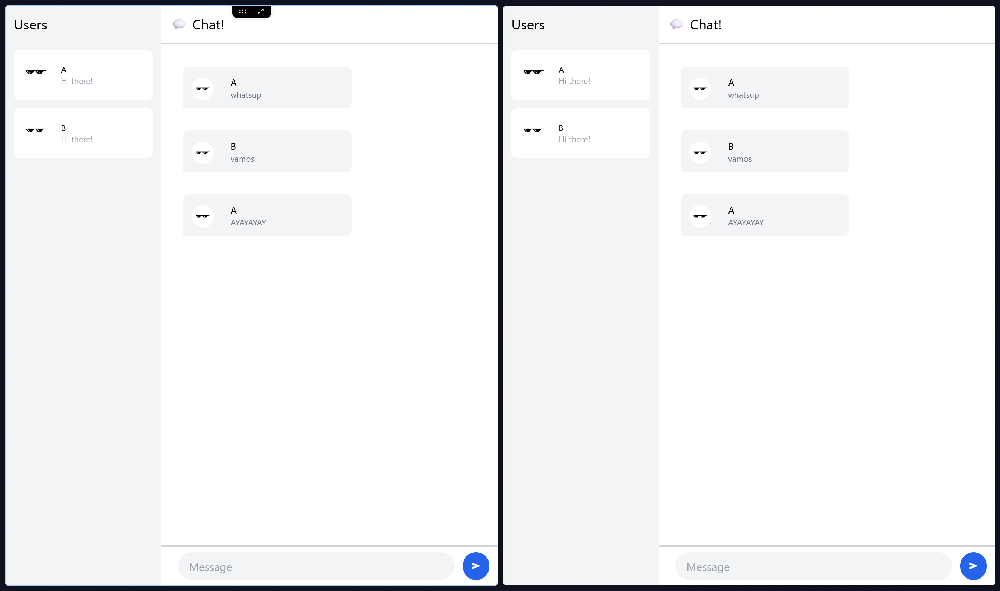
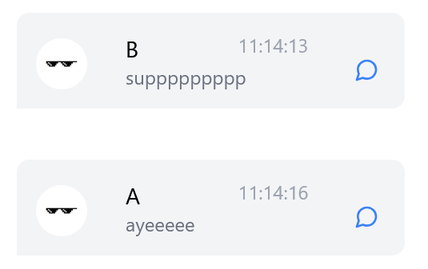
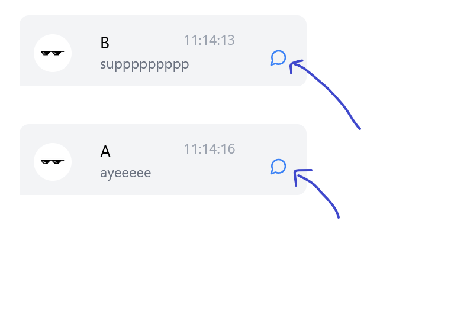
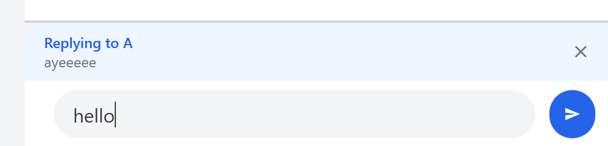
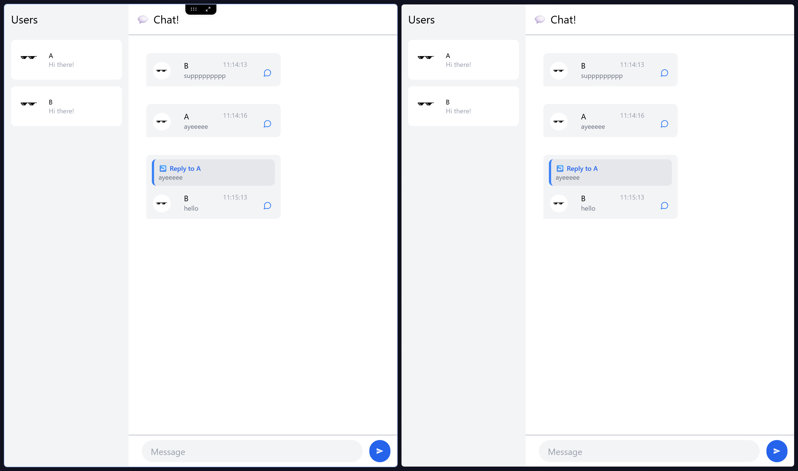

## Yew Chat

### Original Code

### Creative Features: Reply and Timestamp

#### Timestamp Feature

Each message now displays the time it was sent, making it easier to follow conversations and understand message chronology. Times are shown in HH:MM:SS format.

**Implementation Details:**

- Message timestamps are received from the server as Unix timestamps (milliseconds since epoch)
- The `chrono` crate handles conversion from Unix time to formatted time strings
- Timestamps appear in the top-right corner of each message bubble
- The timestamp is visually subtle (gray, smaller text) to avoid distracting from message content

This feature adds important temporal context to conversations, especially useful in active group chats or when referencing past messages.

#### Reply Feature

A reply system has been implemented that allows users to respond directly to specific messages:

**User Flow:**

1. User clicks the reply icon (💬) button on any message
2. A blue "Replying to [username]" indicator appears above the message input
3. The indicator includes a preview of the original message text
4. User types their response and clicks send
5. The new message appears with the quoted original message above it

**Technical Implementation:**

- Messages now include an optional `reply_to` field with the original message's ID, sender, and content
- The server has been modified to handle and broadcast this reply metadata
- Reply relationships are preserved even as new messages arrive
- The reply UI is styled with a distinctive blue accent bar and indented layout
- Users can cancel a reply by clicking the "x" button on the reply indicator

**Benefits:**

- Creates clear conversation threads in busy group chats
- Maintains context when responding to earlier messages
- Helps new participants understand conversation flow
- Reduces confusion when multiple topics are discussed simultaneously

This reply system significantly improves the chat experience by adding structure to conversations without sacrificing the simplicity of the interface.
